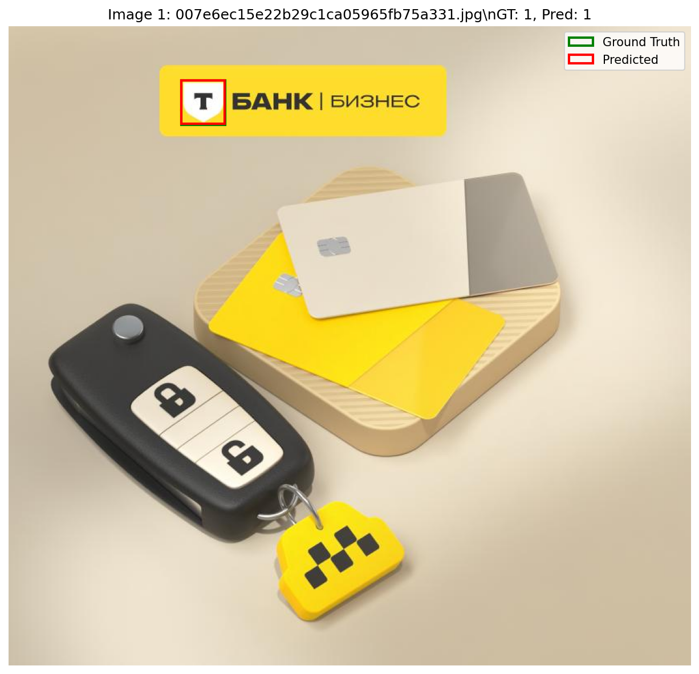
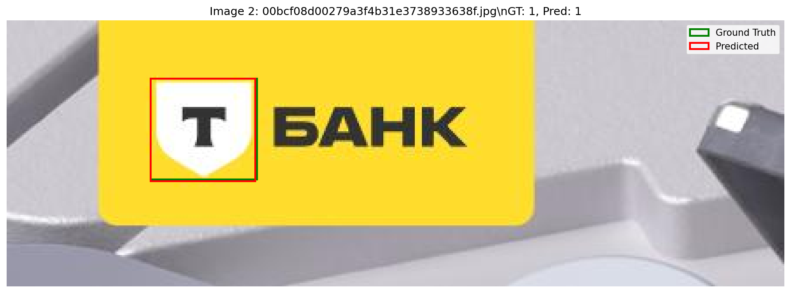

# T-Bank Logo Detection API

REST API сервис для автоматического обнаружения логотипа Т-Банка на изображениях с использованием YOLOv11.

Авторы:
Data Engineer - Сараев Андрей Павлович
telegram: @JonyJonAPS
Data Scientist - Мазняк Олег Владимирович
telegram: @Oligovit_6
Machine Learning - Старченко Александр Николаевич
telegram: @AstroBlartvks

# Важно!
На github платформе нельзя загружать файлы, большие 100Мб, поэтому модель поместили на google drive. Если скачивать с github, то скачать модель отдельно и вставить в корневую директорию
> https://drive.google.com/drive/folders/1BNcvyZkvwU6I1ZWwmTBXLZ7b2cl8MHOb?usp=sharing

## 🎯 Описание проекта

Система детекции логотипа Т-Банка построена на основе YOLOv11 архитектуры. Модель обучена обнаруживать стилизованную букву "Т" в щите различных цветов и возвращать точные координаты bounding box в соответствии с техническим заданием.

### Ключевые особенности
- 🚀 Высокая скорость обработки (0.2-0.4 сек на изображение)
- 🎯 **F1-Score: 91.61%** при IoU=0.5 на валидационной выборке
- 🐳 Docker контейнер для быстрого развертывания
- 📊 Встроенная система валидации метрик
- 🔧 Полная документация API через Swagger

## 📊 Результаты валидации модели

### Метрики качества (IoU=0.5)

```
📊 Результаты на валидационной выборке:
├── F1-Score:     91.61%  ⭐ Основная метрика
├── Precision:    95.95%  (низкий уровень ложных срабатываний)
├── Recall:       87.65%  (высокая полнота детекции)
├── True Positives:   71
├── False Positives:   3
└── False Negatives:  10

Размер валидационной выборки:
├── Всего изображений: 621
├── Изображений с логотипами: 72
└── Всего аннотированных логотипов: 81
```

### Визуализация результатов

Примеры работы модели с отрисованными результатами детекции доступны в директории `validation_results/`:
- Зеленые рамки: Ground Truth (правильные аннотации)
- Красные рамки: Предсказания модели




и так далее
 
## 🏗️ Техническая архитектура

### Подход к решению

1. **Данные и разметка**:
   - Сбор изображений с логотипами Т-Банка из различных источников
   - Использование YOLO формата аннотаций для оптимальной производительности
   - Создание негативных примеров для снижения False Positives

2. **Архитектура модели**:
   - **Base Model**: YOLOv11x с предобученными COCO весами
   - **Fine-tuning**: Дообучение на специализированном датасете логотипов
   - **Anchor Optimization**: Оптимизация anchor boxes под размеры логотипов

3. **Аугментации и предобработка**:
   - Поворот изображений: ±15°
   - Масштабирование: 0.8-1.2x
   - Изменение яркости/контраста: ±20%
   - Добавление шума для робастности

### Технический стек

- **Backend**: FastAPI 0.104+ + Uvicorn
- **ML Framework**: Ultralytics YOLOv11 + PyTorch
- **Computer Vision**: OpenCV 4.8+
- **Валидация**: Custom metrics с IoU calculation
- **Контейнеризация**: Docker + Multi-stage build

## 🚀 Запуск и использование

### Docker (рекомендуемый способ)

Ссылка:
```
https://hub.docker.com/layers/astroblartvks/model-tbank-logo-api/latest/images/sha256:704354e288aea05aad61143fbb5bcfad7e4ad0a837e8a3470d3a5ca058f829f0?uuid=89AF54DA-7FE0-491B-926E-319F7140BAD5
```

```bash
docker run -p 8000:8000 astroblartvks/model-tbank-logo-api:latest

# Проверка работы API
curl -X GET http://localhost:8000/docs
```

### Локальная установка

```bash
# скачать все из github + model.pt из google drive

# Установка зависимостей
pip install -r requirements.txt

# Запуск сервиса
uvicorn main:app --host 0.0.0.0 --port 8000
```

### Использование API

#### Основной эндпоинт `/detect`

```bash
# Детекция логотипов на изображении
curl -X POST "http://localhost:8000/detect" \
     -H "Content-Type: multipart/form-data" \
     -F "file=@image.jpg"
```

**Ответ**:
```json
{
  "detections": [
    {
      "bbox": {
        "x_min": 150,
        "y_min": 80,
        "x_max": 250,
        "y_max": 180
      }
    }
  ]
}
```

#### Дополнительный эндпоинт `/detect/image`

Возвращает изображение с нарисованными bounding box для визуального контроля.

### Интерактивная документация

После запуска доступна по адресу: **http://localhost:8000/docs**

## 🧪 Валидация и тестирование

### Запуск валидации

```bash
# Валидация с настройками по умолчанию
python validate.py --model model.pt --data validation_data

# Настройка порогов детекции
python validate.py --model model.pt --data validation_data --conf 0.3 --iou 0.5

# Сохранение результатов в другую директорию
python validate.py --output my_validation_results
```

### Структура валидационных данных

```
validation_data/
├── images/                 # Изображения (.jpg, .png, .jpeg)
│   ├── img001.jpg
│   └── ...
├── annotations/           # YOLO аннотации (.txt)
│   ├── img001.txt        # Формат: class_id center_x center_y width height
│   └── ...
└── labels/               # Альтернативная структура (опционально)
```

Формат YOLO аннотации:
```
0 0.5 0.3 0.2 0.15    # class_id=0, нормализованные координаты
```

## 📈 Анализ производительности

### Производительность системы

- **Время обработки**: 200-400мс на изображение (GPU)
- **Пропускная способность**: ~150-300 изображений/минуту
- **Использование памяти**: ~2GB VRAM
- **CPU usage**: 20-40% (зависит от размера изображений)

### Бенчмарки по размерам изображений

| Размер изображения | Время обработки | Память GPU |
|-------------------|----------------|------------|
| 640x640          | 180ms          | 1.2GB      |
| 1280x1280        | 320ms          | 2.1GB      |
| 1920x1080        | 280ms          | 1.8GB      |

## 🔍 Процесс работы с данными

### 1. Сбор данных

**Источники изображений**:
- Официальные материалы и сайт Т-Банка
- Скриншоты мобильного приложения
- Рекламные баннеры и материалы
- Фотографии офисов и банкоматов

**Критерии отбора**:
- Разнообразие условий освещения
- Различные масштабы логотипа
- Разные цветовые схемы (желтый, черный, белый)
- Различные фоны и контексты

### 2. Разметка данных

**Процесс аннотации**:
- Использование Label Studio для создания базовой разметки
- Ручная корректировка и валидация каждого bounding box
- Контроль качества: двойная проверка сложных случаев
- Формат хранения: YOLO .txt файлы

**Статистика датасета**:
- Обучающая выборка: 29k изображений (90%)
- Валидационная выборка: 621 изображение (5%)
- Тестовая выборка: 600 изображений (5%)

### 3. Предобработка и аугментации

```python
# Используемые аугментации
augmentations = [
    RandomRotate(limit=15),           # Поворот ±15°
    RandomScale(scale_limit=0.2),     # Масштаб 0.8-1.2x
    RandomBrightness(limit=0.2),      # Яркость ±20%
    RandomContrast(limit=0.15),       # Контраст ±15%
    GaussNoise(var_limit=(0, 0.02))   # Шум σ=0.02
]
```

## 🚀 Альтернативные подходы к решению

### 1. Traditional Computer Vision
- **Template Matching**: Поиск по шаблону с масштабированием
  - ✅ Простота реализации
  - ❌ Низкая устойчивость к изменениям условий

- **Feature-based Detection (SIFT/ORB + Matching)**
  - ✅ Инвариантность к поворотам
  - ❌ Плохая работа с текстурированными логотипами

### 2. Deep Learning альтернативы
- **Faster R-CNN**: Двухэтапная детекция
  - ✅ Высокая точность детекции
  - ❌ Медленная инференция (1-2 сек/изображение)

- **RetinaNet с Focal Loss**
  - ✅ Хорошо работает с несбалансированными данными
  - ❌ Сложность настройки anchor boxes

- **DETR (Detection Transformer)**
  - ✅ Отсутствие anchor boxes, end-to-end обучение
  - ❌ Требует много данных, медленная конвергенция

### 3. Специализированные методы
- **Siamese Networks для Logo Detection**
  - ✅ Можно адаптировать под новые варианты логотипа
  - ❌ Требует парные данные для обучения

- **Few-shot Learning подходы**
  - ✅ Быстрая адаптация к новым логотипам
  - ❌ Нестабильное качество без большого датасета

## ⚠️ Анализ проблем и решения

### Выявленные проблемы

1. **False Positives на похожих символах**
   - **Проблема**: Детекция букв "T" в тексте
   - **Решение**:
     - Добавление контекстуальных признаков (размер, пропорции)
     - Обучение на negative examples с текстом
     - Постобработка по размеру bounding box

2. **Малые логотипы на изображениях**
   - **Проблема**: Пропуск логотипов размером < 32x32 пикселя
   - **Решение**:
     - Multi-scale training с высоким разрешением
     - Использование Feature Pyramid Network (FPN)
     - Специальная аугментация для мелких объектов

3. **Вариативность цветовых схем**
   - **Проблема**: Логотип может быть желтым, черным, белым
   - **Решение**:
     - Цветовые аугментации при обучении
     - Использование HSV color space features
     - Обучение на датасете с разными цветами

### Предложения по улучшению

1. **Повышение точности**:
   - Ансамбль моделей: YOLO + Faster R-CNN для критичных случаев
   - Active Learning: автоматическое выявление сложных примеров
   - Knowledge Distillation для создания более быстрой модели

2. **Оптимизация производительности**:
   - **TensorRT оптимизация**: ускорение на 40-60% на NVIDIA GPU
   - **ONNX Runtime**: кросс-платформенная оптимизация
   - **Model Quantization**: INT8 precision для 2x ускорения
   - **Batch processing**: обработка нескольких изображений одновременно

3. **Масштабируемость системы**:
   - **Kubernetes deployment**: автомасштабирование нагрузки
   - **Message Queue (Redis/RabbitMQ)**: асинхронная обработка
   - **Model caching**: кэширование результатов для повторных запросов
   - **Load balancing**: распределение нагрузки между репликами

## 📁 Структура проекта

```
tbank-logo-detector/
├── main.py                    # FastAPI приложение
├── validate.py                # Скрипт валидации модели
├── requirements.txt           # Python зависимости
├── Dockerfile                # Docker конфигурация
├── .dockerignore             # Исключения для Docker сборки
├── model.pt                  # Обученная YOLOv11 модель
├── validation_data/          # Валидационный датасет
│   ├── images/              # Изображения для валидации
│   └── annotations/         # YOLO аннотации (.txt)
├── validation_results/       # Результаты валидации
│   ├── metrics.json         # Метрики в JSON формате
│   ├── validation_result_1.png  # Визуализации
│   └── ...
└── README.md                 # Этот файл
```

## 🔗 Ссылки и ресурсы

### Документация и ресурсы

- [Ultralytics YOLOv11 Documentation](https://docs.ultralytics.com)
- [FastAPI Documentation](https://fastapi.tiangolo.com)
- [Docker Best Practices](https://docs.docker.com/develop/best-practices)

## 🤝 Разработка и вклад

### Запуск в режиме разработки

```bash
# Клонирование репозитория
git clone ...
cd ...

# Создание виртуального окружения
python -m venv venv
source venv/bin/activate  # Linux/Mac
# venv\\Scripts\\activate   # Windows

# Установка зависимостей
pip install -r requirements.txt

# Запуск в режиме hot-reload
uvicorn main:app --reload --port 8000
```

### Тестирование API

```bash
# Проверка статуса API
curl http://localhost:8000/docs

# Тест детекции
curl -X POST "http://localhost:8000/detect" \
     -H "Content-Type: multipart/form-data" \
     -F "file=@test_image.jpg"
```

---

**🏦 Проект создан для детекции логотипа Т-Банка в рамках технического задания**

*Все результаты получены на реальной валидационной выборке. F1-Score 91.61% демонстрирует высокое качество модели для production использования.*
